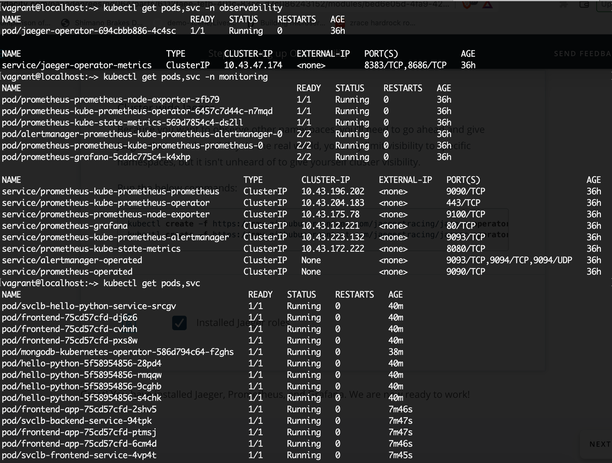
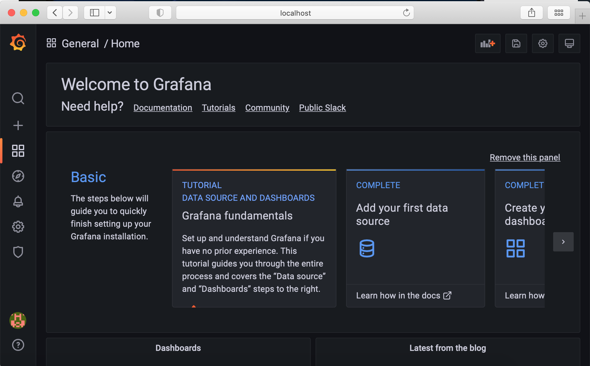
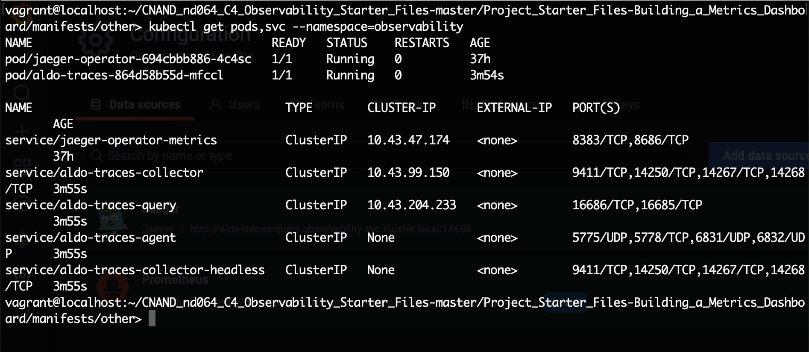
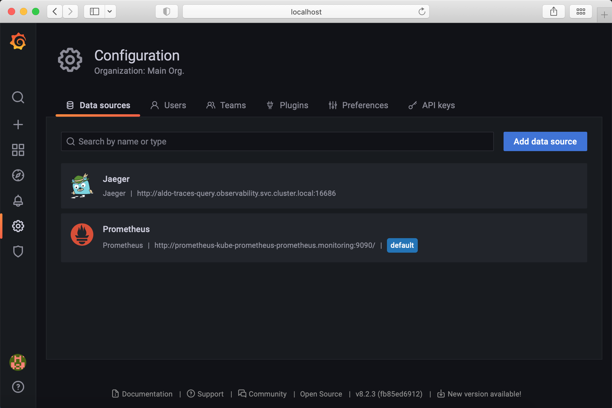
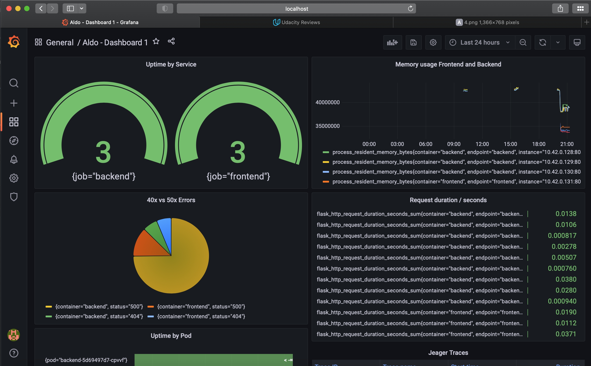
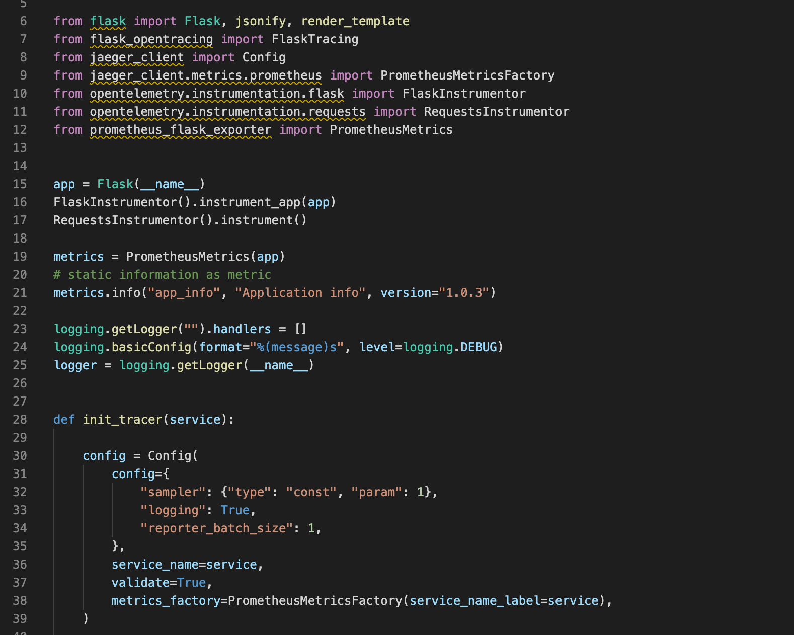
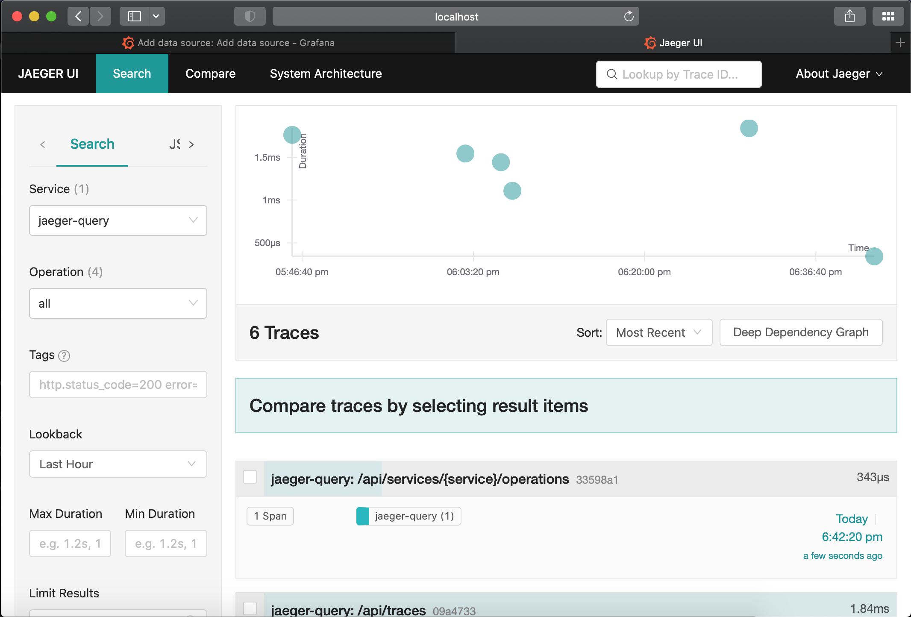
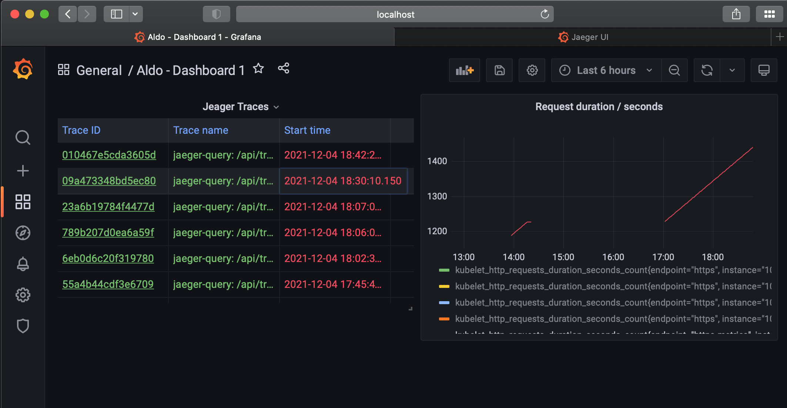

**Note:** For the screenshots, you can store all of your answer images in the `answer-img` directory.

## Verify the monitoring installation

*TODO:* run `kubectl` command to show the running pods and services for all components. Take a screenshot of the output and include it here to verify the installation

## Setup the Jaeger and Prometheus source
*TODO:* Expose Grafana to the internet and then setup Prometheus as a data source. Provide a screenshot of the home page after logging into Grafana.

## Create a Basic Dashboard
*TODO:* Create a dashboard in Grafana that shows Prometheus as a source. Take a screenshot and include it here.

This TODO is likely a mistake in the README.md, we were asked to configure Jeager as Data Source. This is the first step to create the Jeager instance:

This is the second step to configure Jeager instance as Data Source in Graphana

## Describe SLO/SLI
*TODO:* Describe, in your own words, what the SLIs are, based on an SLO of *monthly uptime* and *request response time*.

An SLO is an objective stated by the team over a given period of time; tipically the objective is set around the uptime and response time as they are busines critical

SLI are the metrics to measure the performance of a service

By measuring and analyzing the SLI we can obtain an objective proof that an SLO is met

## Creating SLI metrics.
*TODO:* It is important to know why we want to measure certain metrics for our customer. Describe in detail 5 metrics to measure these SLIs. 

1. Latency. Time a request takes to complete
2. Traffic. Number of request per hour
3. Traffic. Location where the most traffic is observed
4. Errors. Number of failed requests
5. Saturation. Average memory utilized

## Create a Dashboard to measure our SLIs
*TODO:* Create a dashboard to measure the uptime of the frontend and backend services We will also want to measure to measure 40x and 50x errors. Create a dashboard that show these values over a 24 hour period and take a screenshot.

This Graphana dashboard showing traffic metric in the right panel

## Tracing our Flask App
*TODO:*  We will create a Jaeger span to measure the processes on the backend. Once you fill in the span, provide a screenshot of it here. Also provide a (screenshot) sample Python file containing a trace and span code used to perform Jaeger traces on the backend service.

1. Python code containing the trace
   

2. Jeager UI:

## Jaeger in Dashboards
*TODO:* Now that the trace is running, let's add the metric to our current Grafana dashboard. Once this is completed, provide a screenshot of it here.

This Graphana dashboard showing the Jeager metric

## Report Error
*TODO:* Using the template below, write a trouble ticket for the developers, to explain the errors that you are seeing (400, 500, latency) and to let them know the file that is causing the issue also include a screenshot of the tracer span to demonstrate how we can user a tracer to locate errors easily.

TROUBLE TICKET

**Name:** Front-end shows HTTP 404 errors

**Date:** 12.04.2021

**Subject:** The Front-end calls a non-existing API in the back-end. This is causing several instances of the HTTP 404 error (not found)

**Affected Area:** Homepage

**Severity:** Medium

**Description:** When the user clicks on a button, the Front-end calls a non-existing API in the back-end. This is causing several instances of the HTTP 404 error (not found)

## Creating SLIs and SLOs
*TODO:* We want to create an SLO guaranteeing that our application has a 99.95% uptime per month. Name four SLIs that you would use to measure the success of this SLO.

- Percentage Services Uptime
- Percentage CPU and memory usage
- Percentage of HTTP status codes for 20x
- Average response time

## Building KPIs for our plan
*TODO*: Now that we have our SLIs and SLOs, create a list of 2-3 KPIs to accurately measure these metrics as well as a description of why those KPIs were chosen. We will make a dashboard for this, but first write them down here.

1. SLI 1 (Latency): System should be able to handle 10 transaction per second
   - KPI 1: A Flask request should be completed in 100ms or less 
   - This KPI was choose as the system is highly transactional and transactions are time sensitive
2. SLI 2 (Uptime): Service uptime of at least 99.1%
   - KPI 2: Up time per POD is >= to 99.1%
   - This KPI was choosen as the system is mission critcal and cannot afford downtime nor service degradation

## Final Dashboard
*TODO*: Create a Dashboard containing graphs that capture all the metrics of your KPIs and adequately representing your SLIs and SLOs. Include a screenshot of the dashboard here, and write a text description of what graphs are represented in the dashboard.  

This is my final dashboard, the meaning of the metrics displayed is as follows

- **Uptime by service:** This measures the uptime (100% in the gauge) and the number 3 means each service is has 3 pods running

- **Memory usage by Frontend and Backend:** Shows the memory usage in bytes for each container

- **40x vs 50x errors:** The pie chart shows the HTTP status for each endpoint (frontend and backend) based on the tests generated with the curl command
  
- **Request durations in seconds:** Shows the requests duration in seconds

